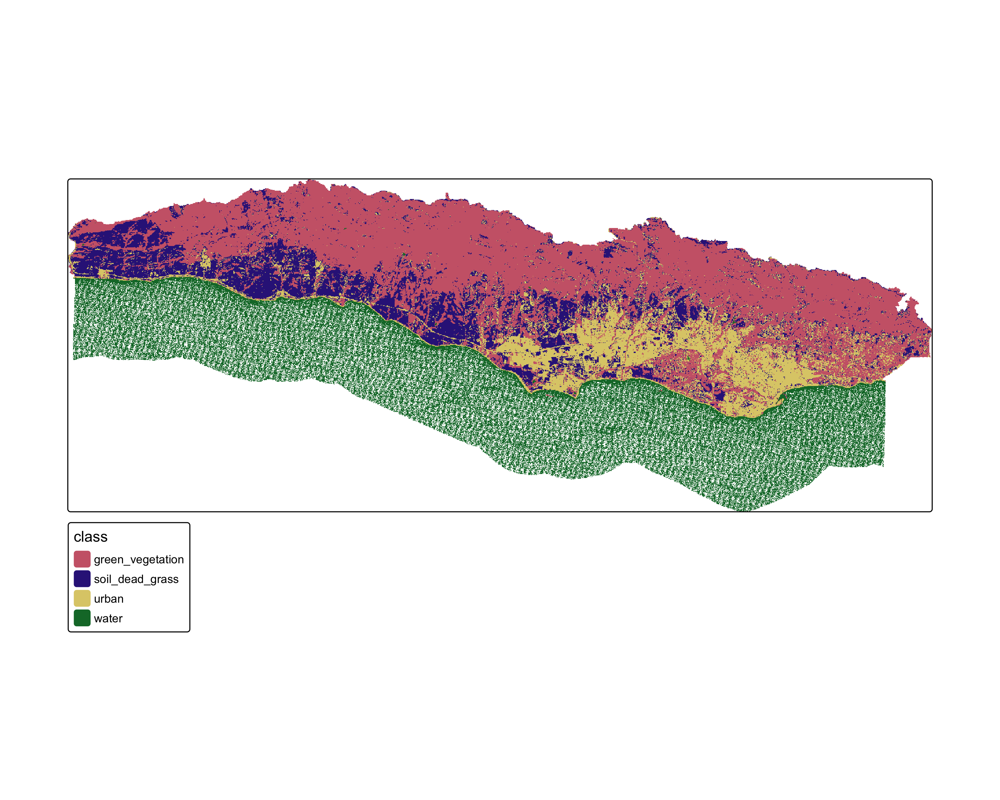

# Santa Barbara Land Cover Classification With Decision Trees



# Table of Contents {#table-of-contents}

-   [Project Title](#project-title)
-   [Quickstart/Demo](#quickstartdemo)
-   [Table of Contents](#table-of-contents)
-   [Installation](#installation)
-   [File structure](#file-structure)
-   [Data](#data)
-   [Usage](#usage)
-   [Contribute](#contribute)
-   [License](#license)

# Installation {#installation}

[(Back to top)](#table-of-contents)

**Repository**: [sb-land_cover-decision_tree](https://github.com/oksanaprotsukha/sb-land_cover-decision_tree)

The analysis is written in R-language. The following tools are required to rerun the analysis:\
- R-ready environment (`RStudio`, `VSCode`),\
- The data is not included in the repo due ot its size. 

# File structure {#file-structure}

[(Back to top)](#table-of-contents)

```         
├── README.md
├── assets
│   └── land_cover_classification.png
├── data
│   ├── SB_county_south.cpg
│   ├── SB_county_south.dbf
│   ├── SB_county_south.prj
│   ├── SB_county_south.sbn
│   ├── SB_county_south.sbx
│   ├── SB_county_south.shp
│   ├── SB_county_south.shx
│   ├── SB_validation_points.dbf
│   ├── SB_validation_points.prj
│   ├── SB_validation_points.qpj
│   ├── SB_validation_points.shp
│   ├── SB_validation_points.shx
│   ├── landsat-data
│   │   ├── LT05_L2SP_042036_20070925_20200829_02_T1_SR_B1.TIF
│   │   ├── LT05_L2SP_042036_20070925_20200829_02_T1_SR_B2.TIF
│   │   ├── LT05_L2SP_042036_20070925_20200829_02_T1_SR_B3.TIF
│   │   ├── LT05_L2SP_042036_20070925_20200829_02_T1_SR_B4.TIF
│   │   ├── LT05_L2SP_042036_20070925_20200829_02_T1_SR_B5.TIF
│   │   └── LT05_L2SP_042036_20070925_20200829_02_T1_SR_B7.TIF
│   ├── trainingdata.cpg
│   ├── trainingdata.dbf
│   ├── trainingdata.prj
│   ├── trainingdata.qpj
│   ├── trainingdata.shp
│   └── trainingdata.shx
└── sb-land_cover-decision_tree.Rproj
```

# Data {#data}

[(Back to top)](#table-of-contents)

To generate a land cover classification of the Santa Barbara, CA region we used the following data:

**Landsat 5 Thematic Mapper**\

-   [Landsat 5](https://www.usgs.gov/landsat-missions/landsat-5)
-   1 scene from September 25, 2007\
-   bands: 1, 2, 3, 4, 5, 7
-   Collection 2 surface reflectance product\

**Study area and training data**

-   polygon representing southern Santa Barbara county
-   polygons representing training sites\
    - type: character string with land cover type\

# Usage {#usage}

[(Back to top)](#table-of-contents) This repo can be used to reproduce and contribute to the analysis.

# Contribute {#contribute}

[(Back to top)](#table-of-contents) Use issues to contribute to the project:

``` shell
https://github.com/oksanaprotsukha/sb-land_cover-decision_tree
```

# License {#license}

[(Back to top)](#table-of-contents)

[MIT license](./LICENSE)
